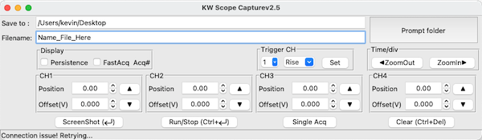
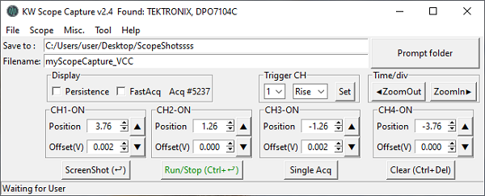
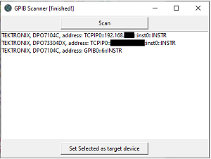
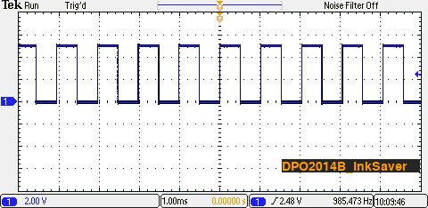
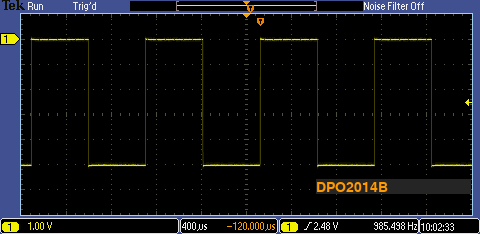
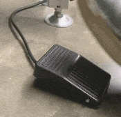
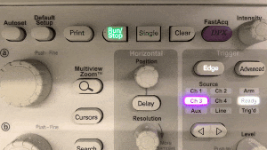
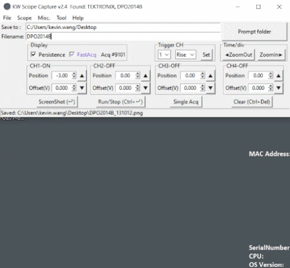

# VISA GUI
**Manipulate your Oscilloscope with keyboard & mouse (or even foot padel !)**

App preview

### >>Download the latest release -> [here](https://github.com/kw81634dr/VISAGUI/releases)

## Features

**availability of such features depends on your scope model.

#### Screen Shot
* Take Screen shot of oscilloscope (shortcut: `Enter`)
* Capture ScreenShot without USB flash drive.
* Add text overlay
* Toggle Ink Saver

#### Channels
* Turn ON/OFF.
* Vertical scale Adjustment.
* Horizontal scale Adjustment. (shortcut: `Ctrl` + `←`/`→`)
* Position & Offset** Adjustment. (mouse wheel supported)

#### Acquisition
* Set `Run`/`Stop` Acq (shortcut: `Ctrl` + `Enter`)
* Set `Single` Acq (shortcut: `Ctrl` + `Enter`)
* `Clear` (shortcut: `Ctrl` + `Del`)
* Toggle FastAcq**
* Toggle Infinite Persistence.
* Signal Trigger adjusment. 

#### Scope
* execute AutoSet
* execute Signal Path Compensation (SPC)*
* Recall factory default setting

#### Handy Tool
* GPIB bus Scanner

## Dependencies
> VISA driver : [NI-488.2(NI-VISA)](https://www.ni.com/en-us/support/downloads/drivers/download.ni-488-2.html#306147), Python libraries : [pyvisa](https://pypi.org/project/PyVISA/),
[PIL](https://pypi.org/project/Pillow/),
[requests](https://pypi.org/project/requests/)

> Tkinter library not found solution for MacOS: `$ brew install python-tk`

[Brew Homepage](https://brew.sh/)

## Tested Compatible model:

|Verified| TeK           | remarks  |
|--------|---------------|---|
|Pending | TBS1052B-EDU  |   |
|&check; | DPO2014B      |   |
|&check; | MSO2024B      |   |
|&check; | DPO4104       |   |
|&check; | MDO4024C      |   |
|&check; | DPO7104       |   |
|&check; | DPO7104C      |   |

Captured ScreenShot from DPO2014B (with & without Ink Saver Enabled)

## One more thing :bulb:
Foot Padel control implementation (Arduino Code available in sub directory)

> Padel definition
> * `RUN/STOP` -- Single step on padel.
> *  Take ScreenShot -- Double Step on padel.
> * `Clear` -- long press then release the padel.

> Pin assignment - using Arduino Leonardo (Pro mini):
>* D2 - NO(normal open) of toggle switch
>* Gnd - COM(common) pin of toggle switch

## Todo
- [ ] Support other brand's scope.
- [ ] Customize Keyboard Shortcut.
- [ ] Transform to MVC model and clean up messy code.

windows `.icn` icon file conversion using: [https://icoconvert.com/](https://icoconvert.com/)