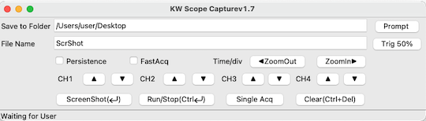
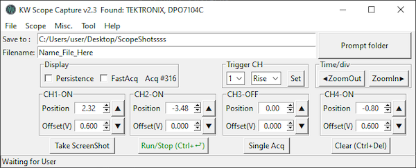
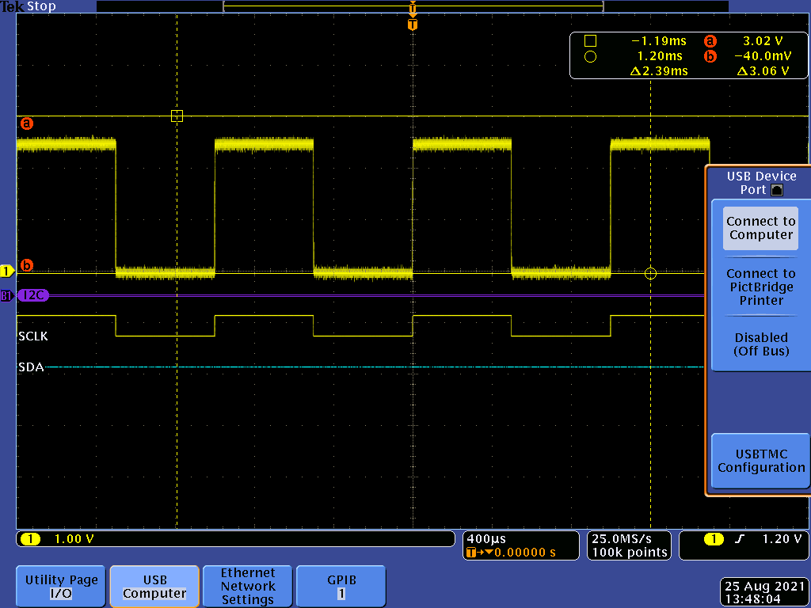
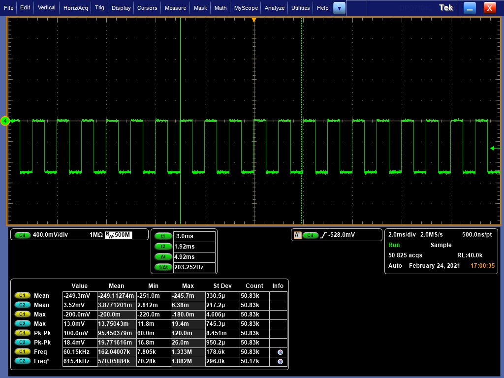

# VISA GUI
**Manipulate your Oscilloscope with keyboard & mouse**

---

App preview

## Features

#### Screen Shot
* Capture ScreenShot without USB flash drive.
* Add text overlay
* Enable Ink Saver

#### Channels
* Turn ON/OFF individually
* Adjust vertical scale individually.
* Adjust horizontal scale. (shortcut: `Ctrl` + `←`/`→`)

#### Acquisition
* Set Run/Stop Acq (shortcut: `Ctrl` + `Enter`)
* Clear (shortcut: `Ctrl` + `Del`)
* Trigger FastAcq*
* Trigger Infinite Persistence

#### Scope
* execute AutoSet
* execute Signal Path Compensation (SPC)*
* Recall factory default setting

#### Handy Tool
* GPIB bus Scanner

*availability of such features depends on your scope model.

##### Dependencies
3rd party driver : [NI-488.2(NI-VISA)](https://www.ni.com/en-us/support/downloads/drivers/download.ni-488-2.html#306147)

3rd party library : [pyvisa](https://pypi.org/project/PyVISA/),
[openCV](https://pypi.org/project/opencv-python/),
[PIL](https://pypi.org/project/Pillow/),
[requests](https://pypi.org/project/requests/)

## Compatible model:

|Verified| TeK           | remarks  |
|--------|---------------|---|
|Pending | TBS1052B-EDU  |   |
|&check; | MSO2024B      |   |
|&check; | DPO4104       |   |
|&check; | MDO4024C      |   |
|&check; | DPO7104       |   |
|&check; | DPO7104C      |   |

Captured ScreenShot from DPO4104

Captured ScreenShot from DPO7104C

## Todo
- [ ] Support other brand's scope.
- [ ] Customize Keyboard Shortcut.
- [ ] Transform to MVC model and clean up messy code.