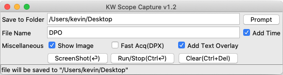
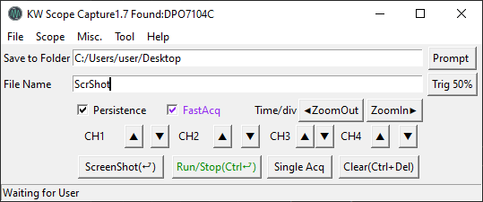

# VISA GUI
##### Manipulate your Oscilloscope with keyboard & mouse

## Features
With the latest version, you're able to access:

#### Screen Shot
* Capture ScreenShot without USB flash drive.
* Add text overlay
* Enable Ink Saver

#### Channels
* Turn ON/OFF individually
* Adjust vertical scale individually.
* Adjust time scale.

#### Acquisition
* Set Run/Stop Acq
* Trigger FastAcq
* Trigger Infinite Persistence

####Handy Tool
* GPIB bus Scanner

##### Dependencies
3rd party driver : [NI-488.2(NI-VISA)](https://www.ni.com/en-us/support/downloads/drivers/download.ni-488-2.html#306147)

3rd party library : [pyvisa](pip install PyVISA), [openCV](https://pypi.org/project/opencv-python/), [PIL](https://pypi.org/project/Pillow/)

## Compatible model:

|Verified| TeK           | remarks  |
|--------|---------------|---|
|Pending | TBS1202B-EDU  |   |
|&check; | MSO2024B      |   |
|&check; | DPO4104       |   |
|&check; | MDO4024C      |   |
|&check; | DPO7104       |   |
|&check; | DPO7104C      |   |

Captured ScreenShot Example from DPO4104

Captured ScreenShot Example from DPO7104C

## Todo
- [ ] Support other brand's scope.
- [ ] Customize Keyboard Shortcut.