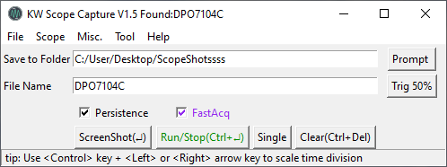

# VISA GUI
##### Manipulate your Oscilloscope with keyboard & mouse

Currently, support Tek MSO/DPO 2000,3000,4000, DPO7000/7000C Series.

verified compatible model: Tek: MSO2024B, DPO1404, DPO7104, DPO7104C

3rd pary Dependencies: pyvisa, openCV, PIL

